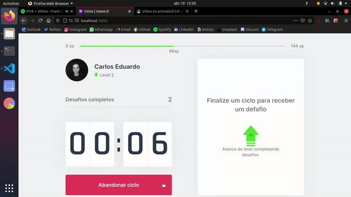

## Move.it

## 🔖 Sobre
<b>Move.it</b> foi um projeto frontend, desenvolvido durante a NLW #4 [Rocketseat]((https://rocketseat.com.br/)), que tem por objetivo incentivar práticas saudáveis a quem fica horas seguidas, no computador. Baseado no método Pomodoro, o Moveit entrega uma interface divertida para te ajudar a manter o <b>foco</b> e <b>produtividade</b>!

## 📷 Preview

  

## 👀 Demo
<h4>Deploy on Vercel: https://moveit-eight-gray.vercel.app/</h4>

## 🚀 Tecnologias utilizadas

- [NextJS](https://github.com/vercel/next.js/)
- [React](https://reactjs.org/)
- [Typescript](https://www.typescriptlang.org/)

